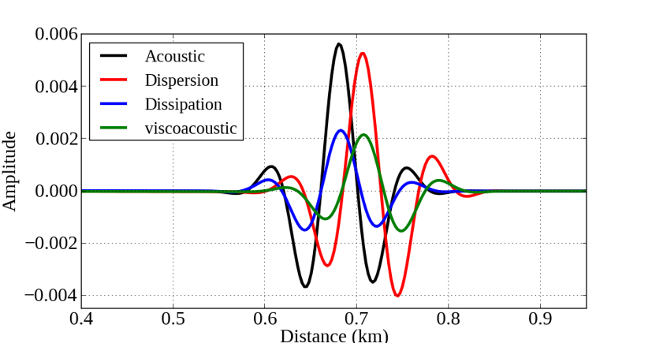

We derive a time-domain complex-valued viscoacoustic wave equation for modelling seismic wave propagation in constant-Q media. The advantages of the proposed viscoacoustic wave equation include (1) that dispersion and dissipation effects are separated, which allows compensating amplitude loss in the migration and inversion by flipping the sign of dissipation term, (2) that quality factor Q is explicitly incorporated in the wave equation, which makes it easier to derive its sensitivity kernel in comparison with constant-Q and generated standard linear solid (GSLS) approaches, and (3) that it can be solved in the time-domain using time matching, which does not require to solve the inverse of impedance matrix and hence saves computational cost compared with the frequency-domain approach.

 Download the data.
