---
# An instance of the Contact widget.
# Documentation: https://wowchemy.com/docs/page-builder/
widget: contact

# This file represents a page section.
headless: true

# Order that this section appears on the page.
weight: 10

title:
subtitle:

### Group Members

#### Doctoral students

---

|                                                              |                                                              |
| :----------------------------------------------------------- | :----------------------------------------------------------- |
| 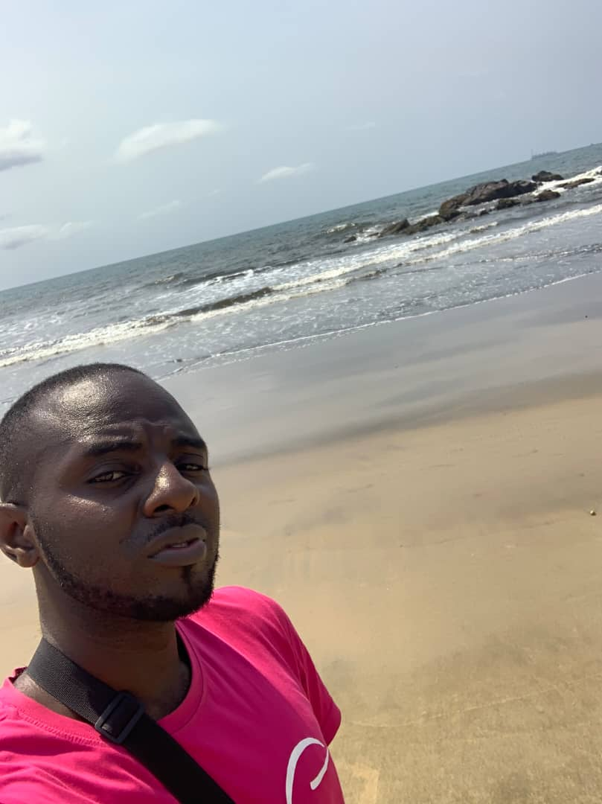 | **2021-Present, Kevin Mba: Earthquake and volcano monitoring** Kevin Zebaze graduated from University of Buea and Douala (Cameroon) with a double master degree in Applied Geology and Sustainable  Management of Coastal and Marine Environment. He join the the University of Petroleum (East China) in 2021 and majored in geological resources and geological engineering for PH.D currently. His research topics include Time-reversal techniques (i.e. back-projection), and numerical modelling . He is an anime fan, humorous, and like sports activities such as Handball and Football. |
|                                                         |                                                              |
| 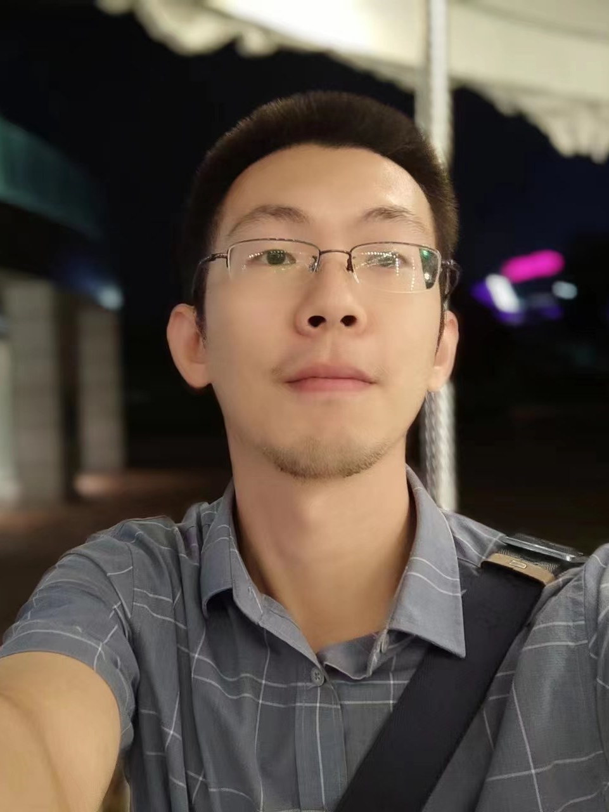 | **2022-Present, Yiwei Tian: Poroelastic modeling and imaging** Yiwei Tian graduated from Nankai University with a bachelor's degree in Mathematics in 2015. He joined the Geoscience and Technology Department in China University of Petroleum (East China) in 2020 and majored in geological resources and geological engineering for Ph.D currently. His research topics include poroelastic forward modeling and reverse time migration. Personally,He is an anime fan and a humorous man who is good at discovering interesting things in life. |
|                                                         |                                                              |
| 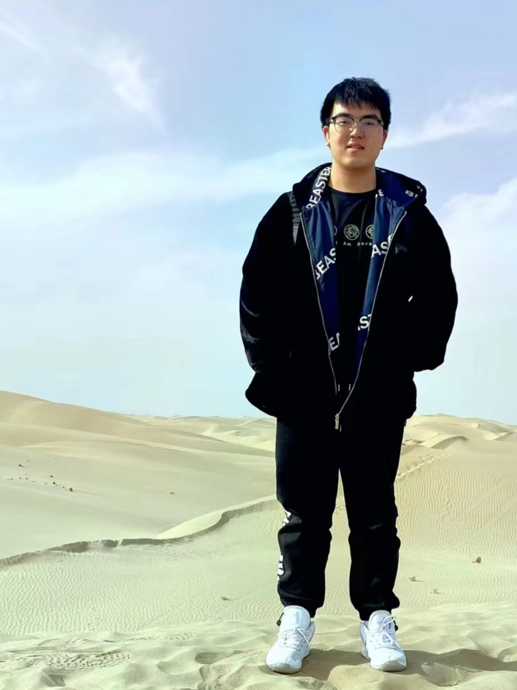 | **2022-Present, Weiqi Wang: Signal processing and Sparse-domain seismic imaging** Weiqi Wang received his Bachelor’s Degree in Process Equipment & Control Engineering from the Shenyang University of Technology China in June 2018, and his Master’s Degree in China University of Petroleum (East China) in June 2022, and started pursuing Ph.D. in geological resources and geological engineering in 2022. His research topics include compressed sensing denoising and reconstruction, empirical mode decomposition technique, strong scattering noise suppression, and other seismic data preprocessing. He is good at playing badminton and table tennis. |
|                                                         |                                                              |
| 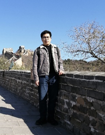 | **2022-Present, Chong Zhao: Least-squares migration with Point-spread function** Chong Zhao received his Bachelor's degree and Master's degree in Xi’an Shiyou University in June 2015 and June 2022 respectively. He joined the Geosciences department at China University of Petroleum (East China) in 2022 and started pursuing Ph.D. in Geophysics. His current work includes Least-squares migration with Point-spread function and Strike-slip faults imaging in Western China. |
|                                                         |                                                              |
| 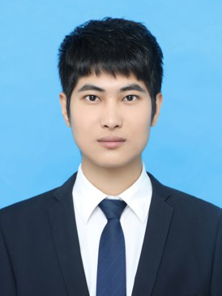 | **2023-Present, Laiyuan Su:** **Passive source imaging**   Laiyuan Su graduated from China University of Petroleum (East China) with a Master’s Degree in June 2023. He is currently a PhD candidate. His research interest includes 1) Exploration seismology: least-squares source imaging, full waveform inversion; 2) Earthquake seismology: earthquake rupture imaging. |
|                                                         |                                                              |
| 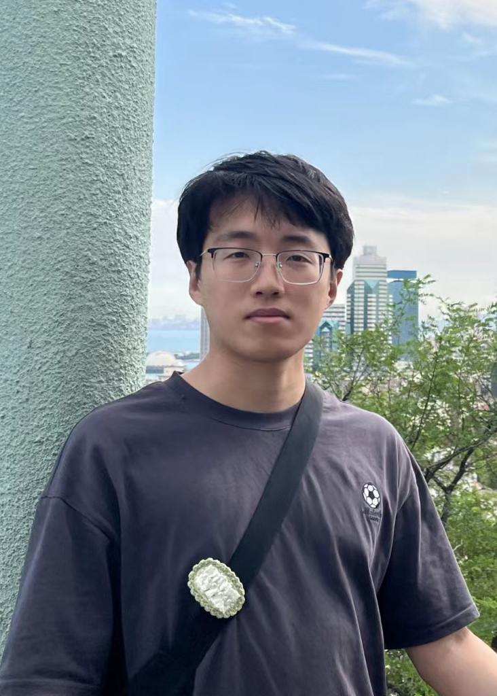 | **2023-Present, Shanyuan Qin: Anisotropic modeling and imaging**  Shanyuan Qin graduated from China University of Petroleum (East China) with a bachelor degree in Geophysics and a double bachelor degree in Law in June 2021 and started pursuing master's degree in the same year. He is interested in wave modelling, seismic migration and structural seismology. He is currently working on acoustic forward modeling and inverse time migration in complex media such as anisotropy and attenuation. In free time, he likes cycling and reading. |
|                                                         |                                                              |
| 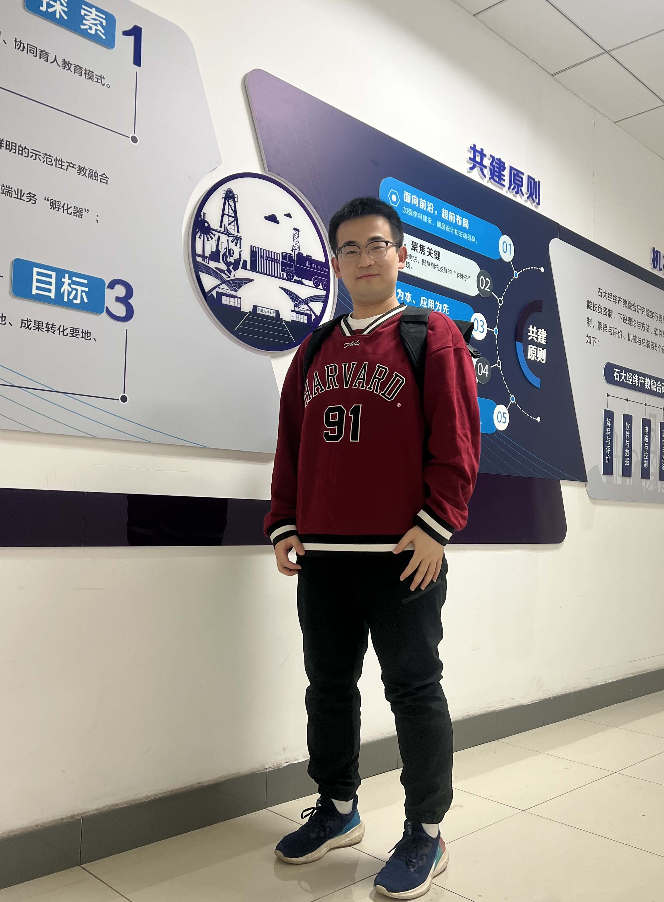 | **2023-Present, Fan Yan: Time-domain least-squares migration** Fan Yan received his Bachelor’s Degree in Prospecting Technology and Engineering from China University of Petroleum (East) in June 2022.In the same year, he studied for a master's degree in the university.He is now studying for a doctor's degree in geophysics.His research topics include wave equation migration and deep learning. |
|                                                         |                                                              |
|  | **2024-Present, Youcai Yu: Full waveform inversion** Youcai Yu  graduated from Shandong University of Science and Technology with a bachelor's degree in exploration technology and engineering in 2021. His main research interest is full-waveform inversion, and he is currently working on new full-waveform inversion objective functions. He enjoys music and traveling. |
|                                                         |                                                              |
| 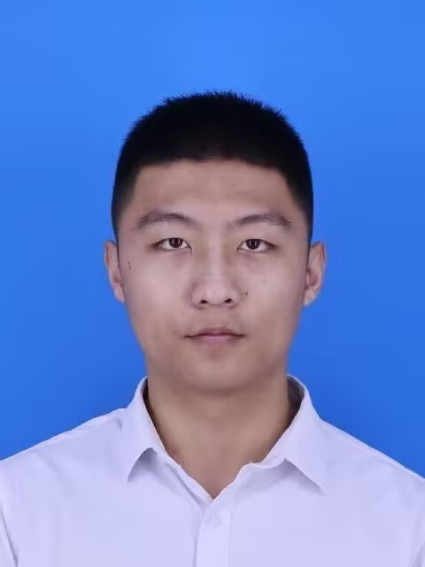 | **2024-Present, Kunpeng Yu: Ambient seismic noise cross-correlation inversion** Kunpeng Yu graduated from China University of Petroleum (East China) with a bachelor degree in Geophysics in June 2023. In the same year, he studied for a master’s degree in the university. He is currently researching on the cross-correlation inversion of seismic ambient noise. In his spare time he prefers to watch movies and videos. |
|                                                         |                                                              |
| 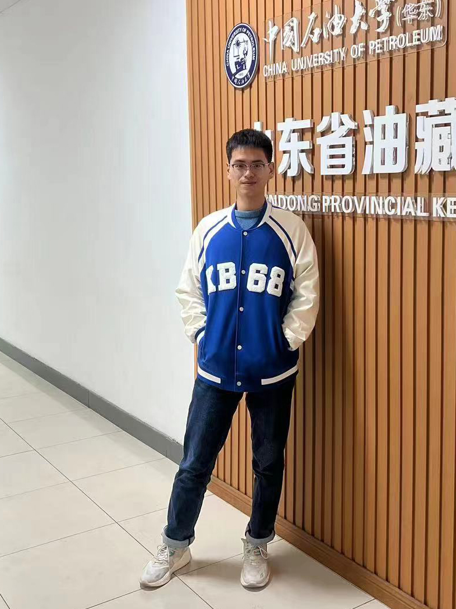 | **2025-Present, Pengfei Wang: Elastic imaging** Pengfei Wang received a bachelor's degree in exploration technology and engineering from Xi'an Shiyou University in 2022, and is now studying at China University of Petroleum (East China) as a master's degree in geological resources and geological engineering, and usually likes sports, such as badminton, basketball and other sports. |
|                                                         |                                                              |
| 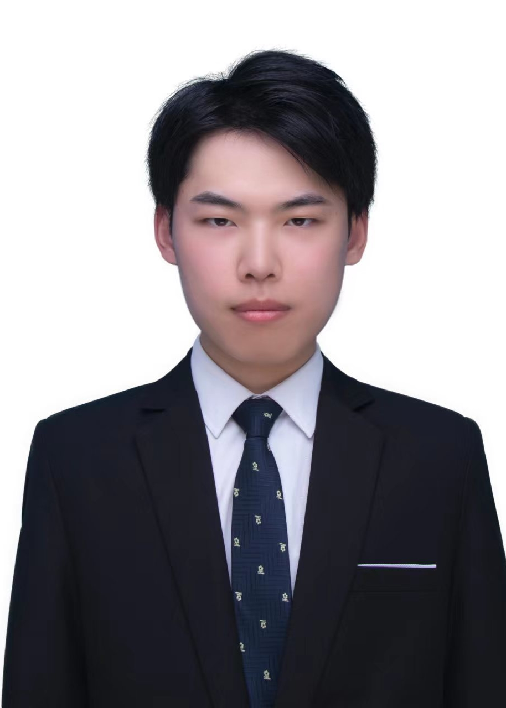 | **2025-Present,TianTao Shan:Gaussian Beam Migration Imaging for VTI Media** Tiantao Shan graduated from Shandong University of Technology in 2023 with a bachelor's degree in exploration technology and engineering. His main research area is Gaussian Beam Migration Imaging for VTI Media. He enjoys traveling and playing basketball. |
|                                                         |                                                              |
| 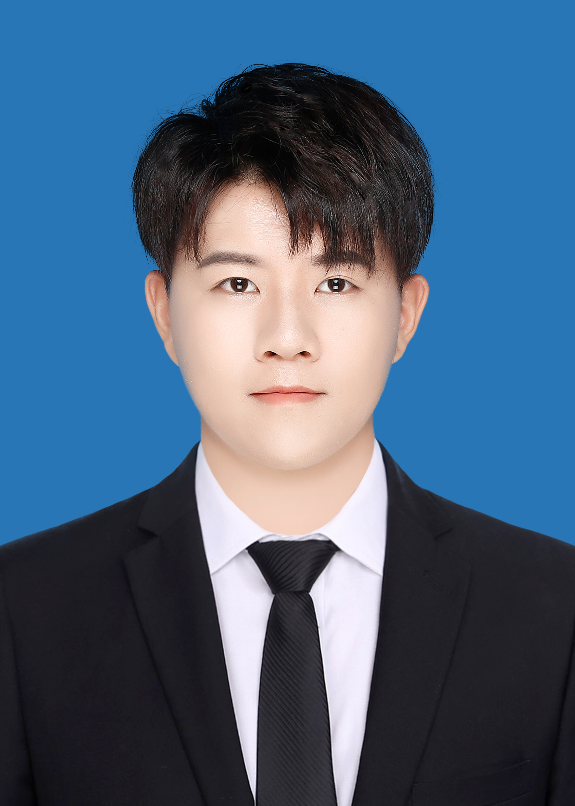 | **2025-Present, Yang Liu: Time-domain least-squares migration** Yang Liu earned his bachelor's degree in geophysics from Xi'an Shiyou University in 2024. He's now pursuing a PhD at China University of Petroleum (East China), where his research focuses on Time-domain least-squares migration. In his free time, he enjoys natural bodybuilding. |

#### Master students

---

|                                                              |                                                              |
| :----------------------------------------------------------- | :----------------------------------------------------------- |
| 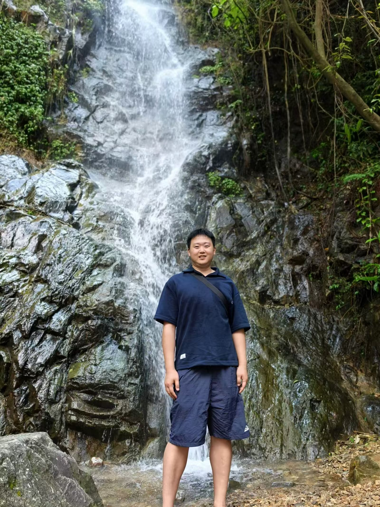 | **2024-2027, Xin Yan: Full waveform inversion** Xin Yan graduated from China University of Petroleum (East China) with a bachelor's degree in geophysics in 2024. Currently, he is undertaking a master's degree at the same university, and his current research is concentrated on intelligent full waveform inversion. During his leisure time, he enjoys watching movies or episodes and taking walks. |
|                                                         |                                                              |
|  | **2024-2027, Wenjing Guo: Deep Learning for seismic imaging**  Wenjing Guo graduated from China Univerity of petroleum(East China) with a bachelor’s degree in geophysics in 2024.Her main research interests is "Application of artificial intelligence to least-squares migration methods in imaging domains".She enjoys various outdoor sports such as running, playing badminton, and prefers to be close to nature. |
|                                                         |                                                              |
| 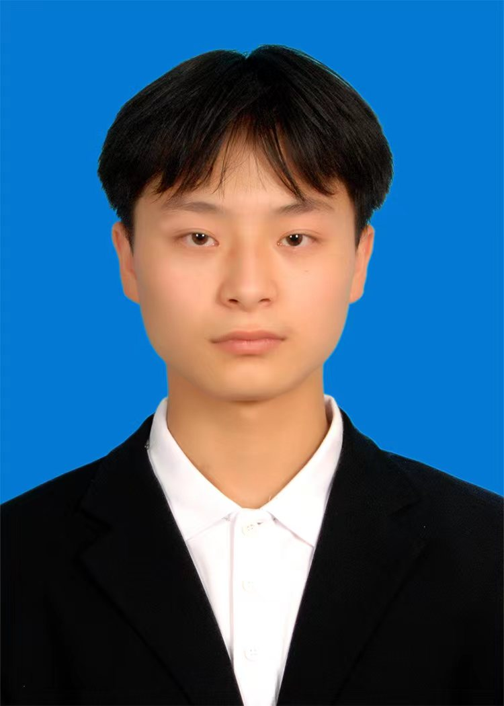 | **2025-2027, Zhaoxing Wang: Helical fiber optic cable forward modeling and noise suppression**  Zhaoxing Wang received the Bachelor’s Degree in Exploration Geophysics from China University of Petroleum (East China) in June 2025. He is currently studying the attenuation of helical fiber optic cable forward modeling and noise suppression. In his free time, he loves outdoor activities such as skiing and runing. |
|                                                         |                                                              |
| 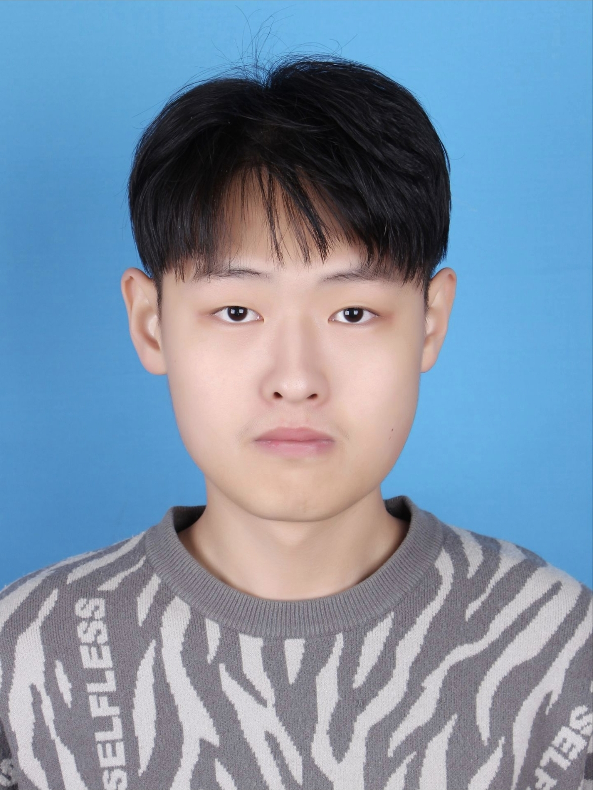 | **2025-2028, Xiaochuan Ge: Seismic imaging resolution**  Xiaochuan Ge graduated from China University of petroleum(East China) with a bachelor’s degree in geophysics in 2025.Currently, he is undertaking a master’s degree at the same university.His main research is concentrated on seismic imaging resolution currently.In his spare time,he enjoys hiking and experiencing culture. |
|                                                         |                                                              |
| 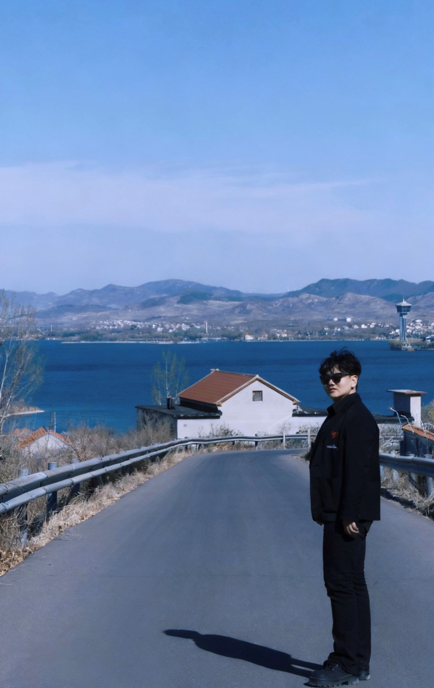 | **2025-2028, Zihan Wei: Wavefield separation and Denoising**  Zihan Wei graduated from China University of Petroleum (East China) with a bachelor’s degree in geophysics in 2024 and worked at SINOPEC Shengli Oilfield as a professional engineer from 2024 to 2025.His main research interest lies in the research on wavefield separation methods for DAS data based on high-resolution Radon transform and geometric mode decomposition.He usually excels in calligraphy, writing, and making friends. |
|                                                         |                                                              |
| 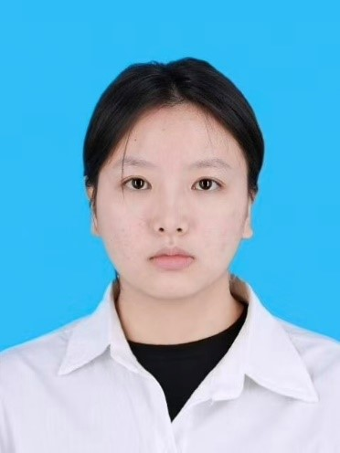 | **2025-2028, Jianjun Pan: Deep Learning for DAS Data Denoising**  Jianjun Pan graduated from Xi'an Shiyou University with a bachelor's degree in Prospecting Technology and Engineering in 2025. She is currently pursuing a master's degree. Her research focuses on DAS data denoising using deep learning. In her leisure time, she enjoys listening to music, traveling, and hiking. |
|                                                         |                                                              |
| 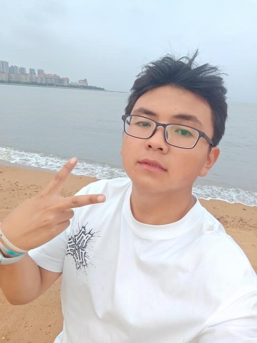 | **2025-2028, Xiaokang Wen: Deep Learning for Seismic Event Analysis**  Xiaokang Wen graduated from China University of Geosciences (Beijing) in 2025 with a Bachelor of Engineering degree in Exploration Technology and Engineering. His main research interest is "Application of deep learning in seismic event clustering analysis and microseismic monitoring". He loves life, enjoys music and sports, is outgoing yet unostentatious, and follows his heart yet not arbitrary. |
|                                                         |                                                              |
| 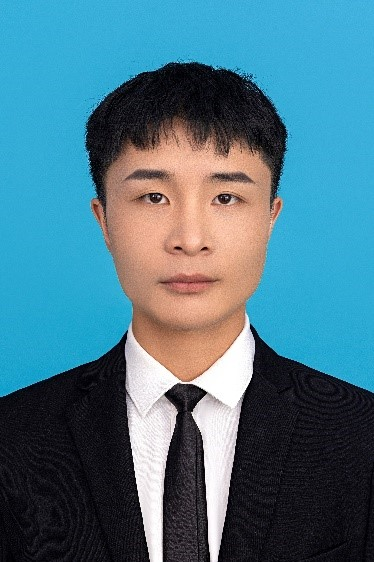 | **2025-2028, Zuo Qi: Ambient noise imaging**  Zuo Qi graduated from Xi'an Shiyou University with a bachelor's degree in Exploration Technology and Engineering in 2025. Currently, she is undertaking a master's degree at the China University of Petroleum (East China), and her current research is concentrated on ambient noise imaging. During her leisure time, she enjoys walking and appreciating the natural scenery. |
|                                                         |                                                              |

   

####  Alumnus

---

|                                                         |                                                              |
| :----------------------------------------------------------- | :----------------------------------------------------------- |
| 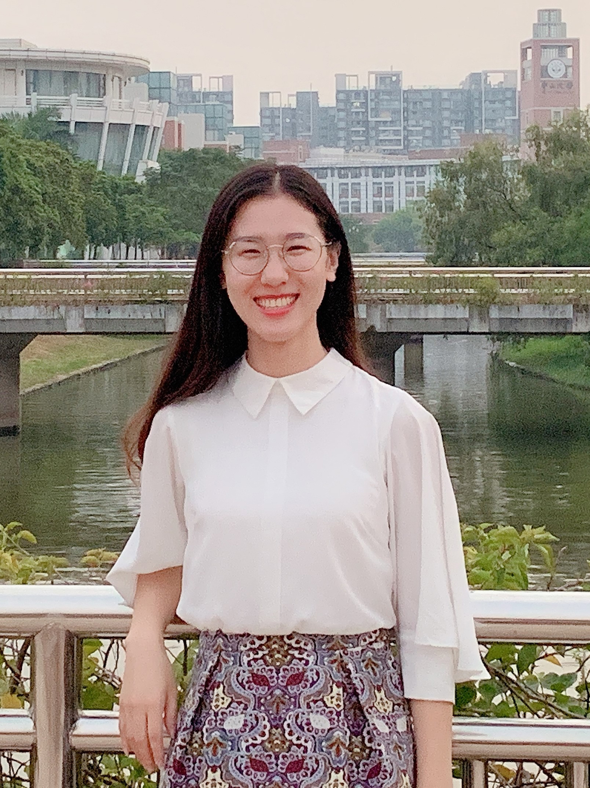 | **2020-2024, Jiaxing Sun: Deep Learning for seismic imaging and inversion** Jiaxing Sun graduated from China University of Petroleum (Beijing) with a master’s degree in Geoscience in June 2020. She joined the China University of Petroleum (East China) in September 2020 and started pursuing Ph.D. Her current work mainly focused on using the deep learning for seismic AVO inversion, least-squares migration, diffraction/reflection separation and wavefield separation. In her free time, she loves outdoor activities such as climbing and skiing. |
|                                                         |                                                              |
| 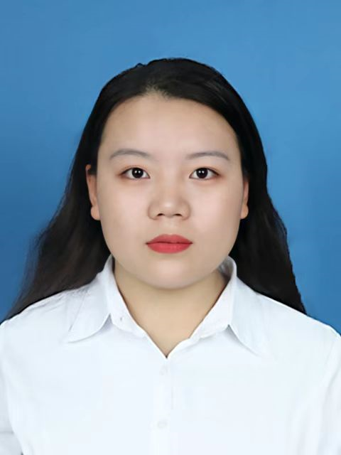 | **2021-2024, Jie Xu: Full-wavefield imaging**   Jie Xu graduated from China Univerity of petroleum(East China) with a bachelor's degree in exploration technology and engineering in 2021. Her main research interests are in Marchenko imaging using multiples to image. She likes to travel and experience the customs and characteristics of different places. |
|                                                         |                                                              |
| 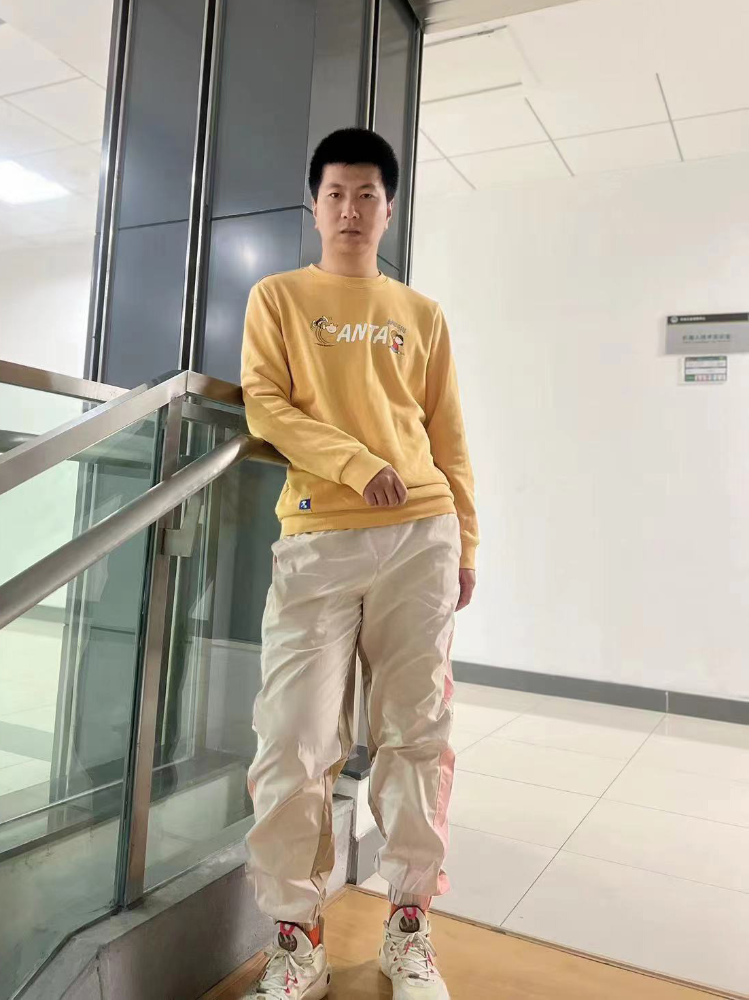 | **2021-2024, Zhiwen Shi: DAS-related modeling and imaging** Zhiwen Shi graduated from Chang’an University with a bachelor’ s degree geophysics and engineering in 2021. His main research interesting is numerical simulation and imaging of distributed acoustic sensing. He likes playing basketball and cycling. |
|                                                         |                                                              |
| 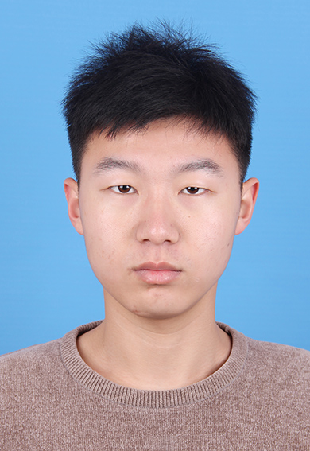 | **2022-2025, Hao Zhang: Removal of "black triangle" noise** Hao Zhang received his Bachelor’s Degree in Exploration Geophysics from China University of Petroleum (East China) in June 2022. He is currently a master's student interested in seismic processing. He is currently studying the attenuation of black triangle noise caused by undulating surface environments.In his free time, he loves outdoor activities such as skiing and badminton. |
|                                                              |                                                              |
| 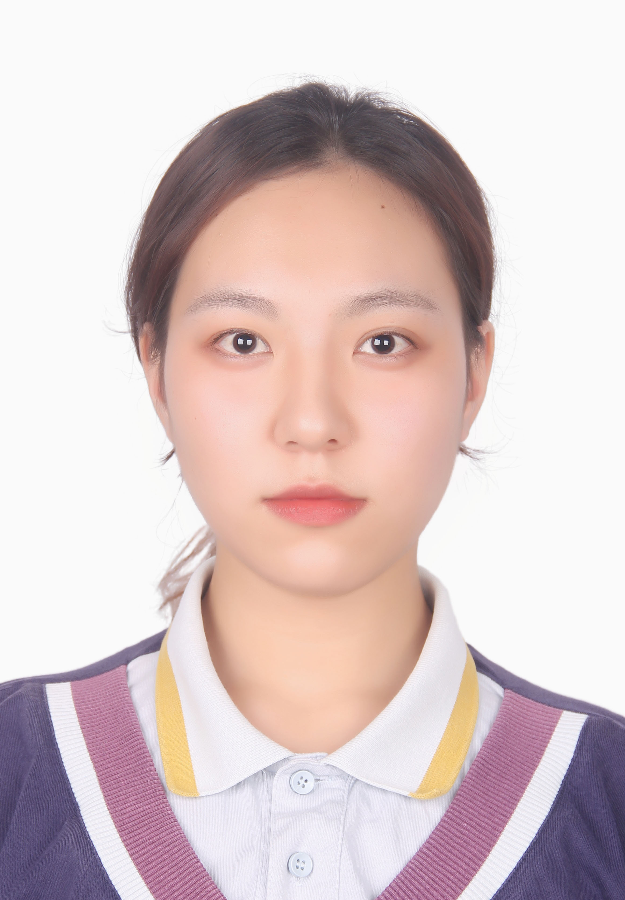 | **2023-2025, Xuanhao Chen: Deep learning for diffraction separation and imaging** Xuanhao Chen holds a master‘s degree in geophysics from China University of Petroleum (East China). Her research focuses on deep learning-based diffraction wave separation and imaging. In her spare time, she likes playing badminton and table tennis. |

### Openings

We are looking for qualified students with strong motivation on seismology and geophysics. Please feel free to contact Dr. Jidong Yang ([jidong.yang@upc.edu.cn](mailto:jidong.yang@upc.edu.cn)) if you have any questions about master and doctoral application at China University of Petroleum.

