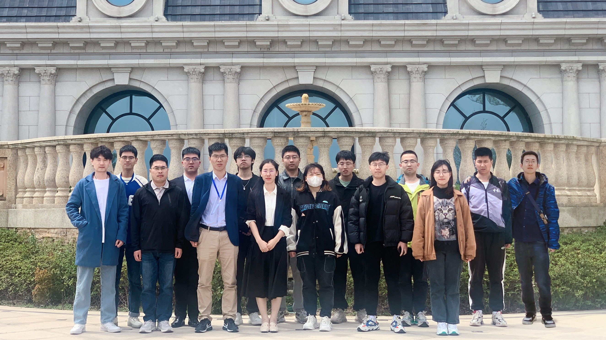
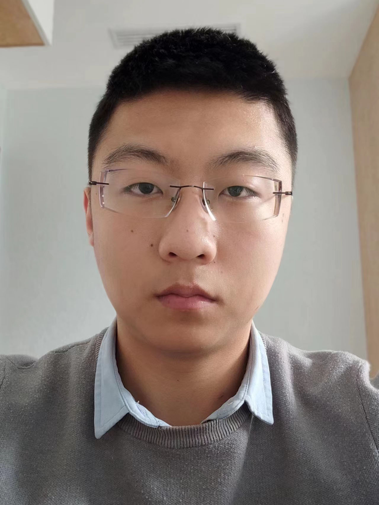

---
# An instance of the Contact widget.
# Documentation: https://wowchemy.com/docs/page-builder/
widget: contact

# This file represents a page section.
headless: true

# Order that this section appears on the page.
weight: 10

title:
subtitle:

design:
  columns: '1'
---

### Group Members

#### Doctoral students

---

|                                                              |                                                              |
| :----------------------------------------------------------- | :----------------------------------------------------------- |
|  | **2020-Present, Jiaxing Sun: Deep Learning for seismic imaging and inversion** Jiaxing Sun graduated from China University of Petroleum (Beijing) with a master’s degree in Geoscience in June 2020. She joined the China University of Petroleum (East China) in September 2020 and started pursuing Ph.D. Her current work mainly focused on using the deep learning for seismic AVO inversion, least-squares migration, diffraction/reflection separation and wavefield separation. In her free time, she loves outdoor activities such as climbing and skiing. |
|                                                         |                                                              |
|  | **2021-Present, Kevin Mba: Earthquake and volcano monitoring** Kevin Zebaze graduated from University of Buea and Douala (Cameroon) with a double master degree in Applied Geology and Sustainable  Management of Coastal and Marine Environment. He join the the University of Petroleum (East China) in 2021 and majored in geological resources and geological engineering for PH.D currently. His research topics include Time-reversal techniques (i.e. back-projection), and numerical modelling . He is an anime fan, humorous, and like sports activities such as Handball and Football. |
|                                                         |                                                              |
|  | **2022-Present, Yiwei Tian: Poroelastic modeling and imaging** Yiwei Tian graduated from Nankai University with a bachelor's degree in Mathematics in 2015. He joined the Geoscience and Technology Department in China University of Petroleum (East China) in 2020 and majored in geological resources and geological engineering for Ph.D currently. His research topics include poroelastic forward modeling and reverse time migration. Personally,He is an anime fan and a humorous man who is good at discovering interesting things in life. |
|                                                         |                                                              |
|  | **2022-Present, Weiqi Wang: Signal processing and Sparse-domain seismic imaging** Weiqi Wang received his Bachelor’s Degree in Process Equipment & Control Engineering from the Shenyang University of Technology China in June 2018, and his Master’s Degree in China University of Petroleum (East China) in June 2022, and started pursuing Ph.D. in geological resources and geological engineering in 2022. His research topics include compressed sensing denoising and reconstruction, empirical mode decomposition technique, strong scattering noise suppression, and other seismic data preprocessing. He is good at playing badminton and table tennis. |
|                                                         |                                                              |
|  | **2022-Present, Chong Zhao: Least-squares migration with Point-spread function** Chong Zhao received his Bachelor's degree and Master's degree in Xi’an Shiyou University in June 2015 and June 2022 respectively. He joined the Geosciences department at China University of Petroleum (East China) in 2022 and started pursuing Ph.D. in Geophysics. His current work includes Least-squares migration with Point-spread function and Strike-slip faults imaging in Western China. |
|                                                         |                                                              |
|  | **2023-Present, Laiyuan Su:** **Passive source imaging**   Laiyuan Su graduated from China University of Petroleum (East China) with a Master’s Degree in June 2023. He is currently a PhD candidate. His research interest includes 1) Exploration seismology: least-squares source imaging, full waveform inversion; 2) Earthquake seismology: earthquake rupture imaging. |
|                                                         |                                                              |
|  | **2023-Present, Shanyuan Qin: Anisotropic modeling and imaging**  Shanyuan Qin graduated from China University of Petroleum (East China) with a bachelor degree in Geophysics and a double bachelor degree in Law in June 2021 and started pursuing master's degree in the same year. He is interested in wave modelling, seismic migration and structural seismology. He is currently working on acoustic forward modeling and inverse time migration in complex media such as anisotropy and attenuation. In free time, he likes cycling and reading. |
|                                                         |                                                              |
|  | **2023-Present, Fan Yan: Time-domain least-squares migration** Fan Yan received his Bachelor’s Degree in Prospecting Technology and Engineering from China University of Petroleum (East) in June 2022.In the same year, he studied for a master's degree in the university.He is now studying for a doctor's degree in geophysics.His research topics include wave equation migration and deep learning. |
|                                                         |                                                              |

#### Master students

---

|                                                         |                                                              |
| :----------------------------------------------------------- | :----------------------------------------------------------- |
|  | **2021-2024, Jie Xu: Full-wavefield imaging**   Jie Xu graduated from China Univerity of petroleum(East China) with a bachelor's degree in exploration technology and engineering in 2021. Her main research interests are in Marchenko imaging using multiples to image. She likes to travel and experience the customs and characteristics of different places. |
|                                                         |                                                              |
|  | **2021-2024, Youcai Yu: Full waveform inversion** Youcai Yu  graduated from Shandong University of Science and Technology with a bachelor's degree in exploration technology and engineering in 2021. His main research interest is full-waveform inversion, and he is currently working on new full-waveform inversion objective functions. He enjoys music and traveling. |
|                                                         |                                                              |
|  | **2021-2024, Zhiwen Shi: DAS-related modeling and imaging** Zhiwen Shi graduated from Chang’an University with a bachelor’ s degree geophysics and engineering in 2021. His main research interesting is numerical simulation and imaging of distributed acoustic sensing. He likes playing basketball and cycling. |
|                                                         |                                                              |
|  | **2022-2025, Hao Zhang: Removal of "black triangle" noise** Hao Zhang received his Bachelor’s Degree in Exploration Geophysics from China University of Petroleum (East China) in June 2022. He is currently a master's student interested in seismic processing. He is currently studying the attenuation of black triangle noise caused by undulating surface environments.In his free time, he loves outdoor activities such as skiing and badminton. |
|                                                         |                                                              |
|  | **2022-2025, Pengfei Wang: Elastic imaging** Wang Pengfei received a bachelor's degree in exploration technology and engineering from Xi'an Shiyou University in 2022, and is now studying at China University of Petroleum (East China) as a master's degree in geological resources and geological engineering, and usually likes sports, such as badminton, basketball and other sports. |
|                                                         |                                                              |
|  | **2023-2025, Xuanhao Chen: Deep learning for diffraction separation and imaging** Xuanhao Chen holds a master‘s degree in geophysics from China University of Petroleum (East China). Her research focuses on deep learning-based diffraction wave separation and imaging. In her spare time, she likes playing badminton and table tennis. |
|                                                         |                                                              |
|  | **2023-2025, Kunpeng Yu: Ambient seismic noise cross-correlation inversion** Kunpeng Yu graduated from China University of Petroleum (East China) with a bachelor degree in Geophysics in June 2023. In the same year, he studied for a master’s degree in the university. He is currently researching on the cross-correlation inversion of seismic ambient noise. In his spare time he prefers to watch movies and videos. |
|                                                         |                                                              |
|  | **2023-2026,TianTao Shan:Gaussian Beam Migration Imaging for VTI Media** Tiantao Shan graduated from Shandong University of Technology in 2023 with a bachelor's degree in exploration technology and engineering. His main research area is Gaussian Beam Migration Imaging for VTI Media. He enjoys traveling and playing basketball. |

       

### Openings

We are looking for qualified students with strong motivation on seismology and geophysics. Please feel free to contact Dr. Jidong Yang ([jidong.yang@upc.edu.cn](mailto:jidong.yang@upc.edu.cn)) if you have any questions about master and doctoral application at China University of Petroleum.

