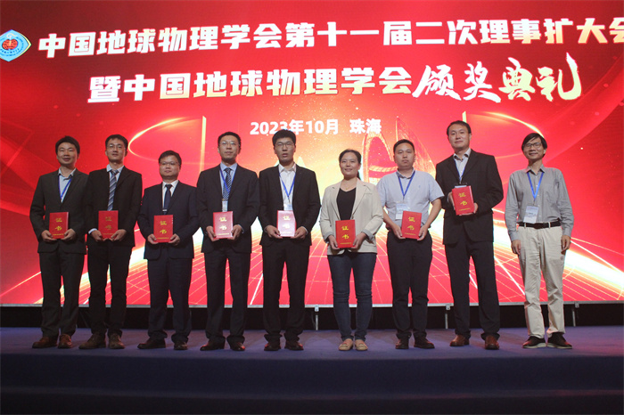

---
# This file represents a page section.
headless: true

# Order that this section appears on the page.
weight: 79

title: 傅承义青年科技奖
subtitle: ''

# Page order: descending (desc) or ascending (asc) date.
order: desc
design:
  # Choose a view for the listings:
  view: citation
  columns: '1'
---

 

2023年中国地球科学联合学术年会于10月14-17日在珠海召开。15日下午，中国地球物理学会十一届二次理事扩大会暨颁奖典礼在珠海国际会展中心隆重举行，中国石油大学地球与科学技术学院杨继东教授荣获2023年度 “傅承义青年科技奖”，以表彰其在地球物理领域的成绩。

 

    

 

傅承义青年科技奖，始于1997年，由中国地球物理学会设立，旨在纪念我国著名地球物理学家、中国科学院院士傅承义。该奖旨在推动地球物理学基础和应用基础研究，特别是鼓励45岁以下地球物理工作者开展创新性工作。评选过程由傅承义青年科技奖评奖委员会负责，候选人经过层层评审，最终由委员会通过投票确定。奖项每年评选一次，每次授予5-10人，2023年全国科研院所共有8人获奖。

 

A detailed introduction can [click this link.](https://geori.upc.edu.cn/2023/1106/c3557a415423/page.htm)
