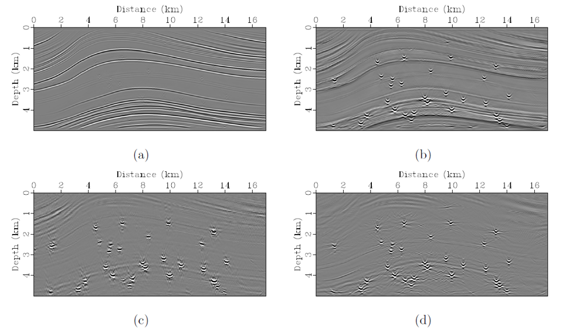

In exploration seismology, the reflections have been extensively used for imaging and inversion to detect hydrocarbon and mine resources, which are generated from subsurface continuous impedance interfaces. When the reflector is not continuous and its size reduces to less than half wavelength, the reflected wave becomes scattering, which is also known as the diffraction. Both reflection and diffraction can be used to image subsurface structures, and the latter is helpful to resolve small-scale discontinuities, such as fault plane, pinch-out, Karst caves and salt edge. However, the amplitudes of diffractions are usually much weaker than that of reflections. This makes it difficult to directly identify and extract diffractions from common-shot gathers. On the other hand, they have different geometrical characteristics in the dip-angle common-image gathers (DACIGs), which provides one opportunity to separate diffractions and reflections. In this study, we present an efficient and accurate diffraction separation and imaging method using convolutional neural network (CNN). The labeled data of DACIGs are generated using one pass of seismic modeling and migration for velocity models with and without artificial scatterers. Then, a simplified end-to-end CNN is trained to identify and extract reflections from the DACIGs that contain both reflections and diffractions. Next, two adaptive subtraction strategies are presented to compute diffraction DACIGs and stacked images.
