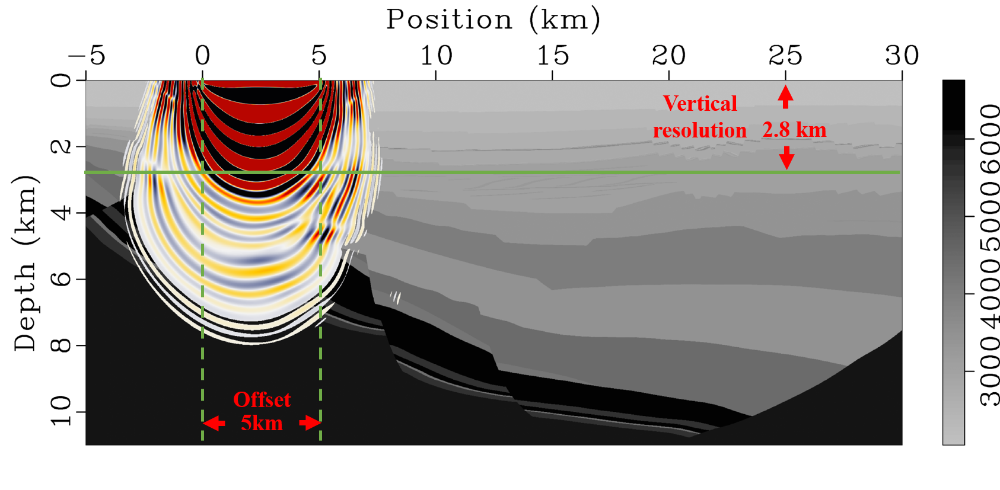
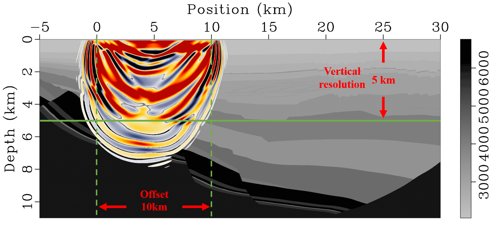
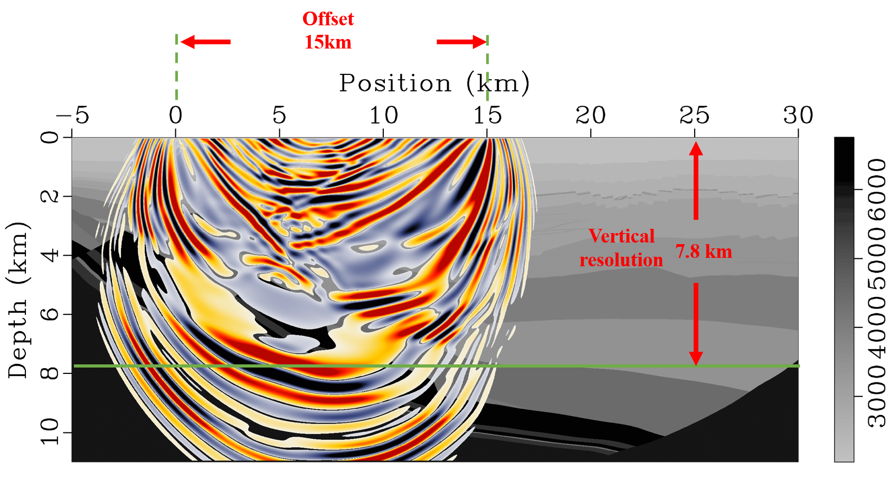

---

title: Wave field modeling and sensitive kernel analysis
subtitle: 
summary: Wave field modeling and sensitive kernel analysis in part of the Shengli model
authors:
- admin
tags: [Modeling]
tags: [Inversion]
weight: 70
categories: []
projects: []
date: "2022-04-29"
image:
  caption: ""
  focal_point: ""
---

 

### 
Wave field simulation in part of the Shengli model

 

### 
Sensitive kernel analysis

######  ● 5km reception, penetration depth of about 2.8km

######  ● 10km reception, penetration depth of about 5km

######  ● 15km reception, penetration depth of about 7.8km

###### ● 20km reception, penetration depth of about 9.8km

######  ● **25km reception, penetration depth of about 10km**

